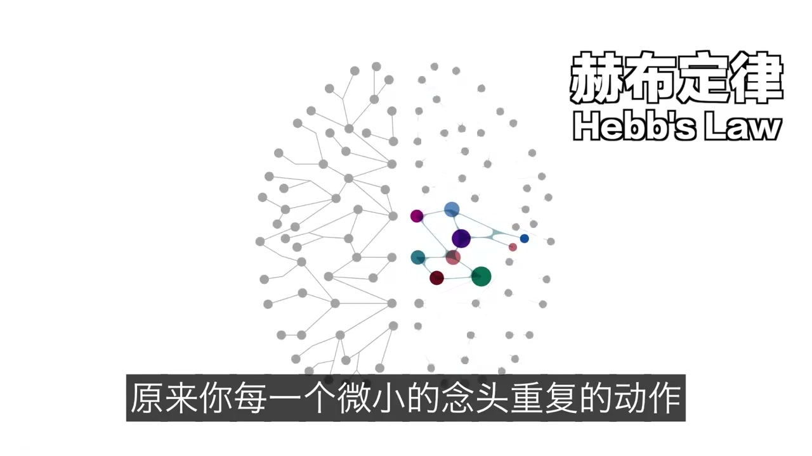
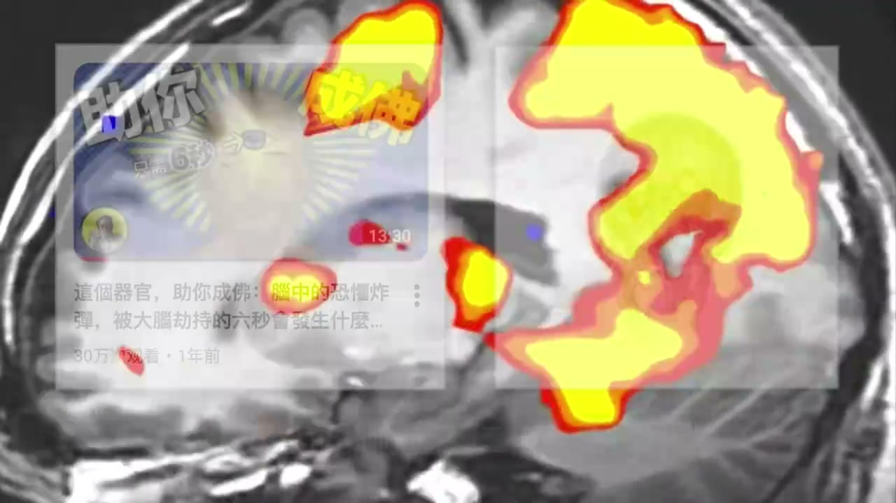
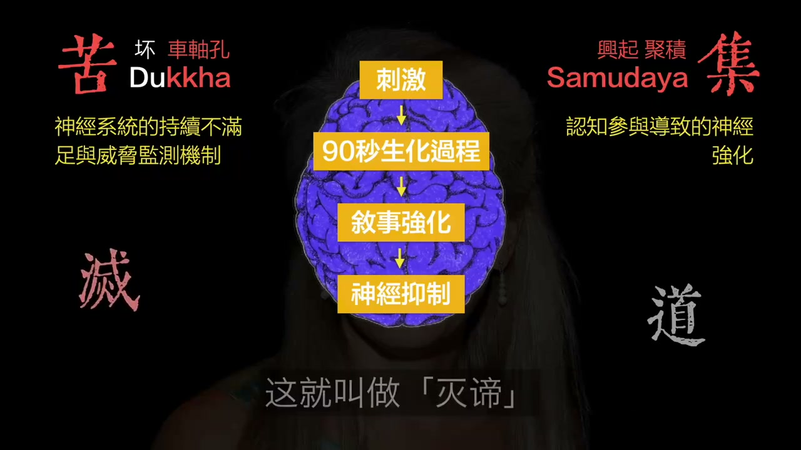
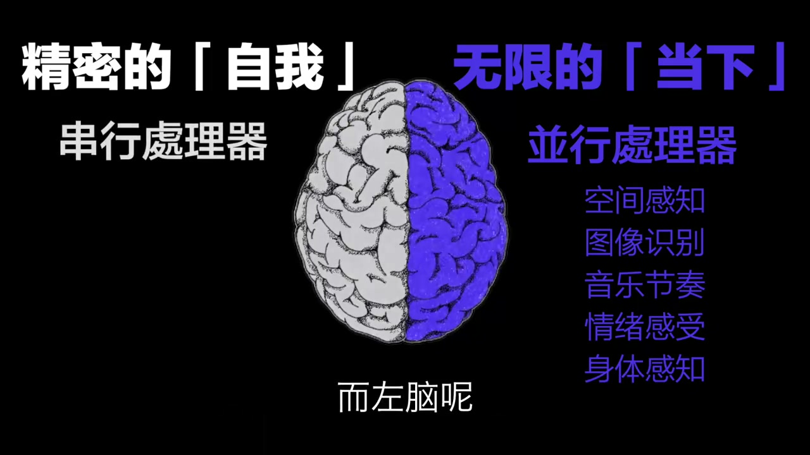

# 大脑真能像系统一样“重装”吗？

这期视频试图讲一个很抓人的命题：**大脑是不是一台可以重装系统的机器？《金刚经》里讲的“凡所有相，皆是虚妄”，会不会早就点中了现代脑科学的某些核心问题？**

它选用的切入口，是美国神经解剖学家 **Jill Bolte Taylor（吉尔·博尔特·泰勒）** 的真实经历：一次严重脑卒中，让她亲身体验到语言、自我边界、时间感和逻辑能力逐步失灵，也体验到一种强烈的“与万物融为一体”的感受。视频随后把这段经历，与佛学里关于“无我”“空性”“妄念”的表达做了并置。

整体上，这是一条**叙事性很强、情绪感染力很高、但科学与哲学边界被有意拉近**的视频。它适合传播，也有启发性，但不能把其中的类比直接当成严格科学结论。

---

## 一、视频到底在讲什么

视频的主线可以概括成四步：

### 1. 用 Jill Bolte Taylor 的脑卒中经历，证明“自我感”并不牢固

视频讲到，Jill 原本是研究大脑的科学家。她在脑卒中发作时，逐步失去了语言、符号识别、时间顺序感和清晰的自我边界，甚至一度感觉自己不再是一个独立个体，而是融进更大的能量流里。

这部分想说明的是：

- 我们平时以为非常稳固的“我”
- 我们以为天然存在的“边界感”
- 我们对世界的连续、清晰、可命名的体验

其实都依赖大脑的正常运行。一旦某些脑区失常，这个“我”会明显松动，甚至暂时瓦解。

### 2. 把“左脑/右脑”讲成两套不同的现实建模方式

视频大量使用一种通俗表达：

- 左脑偏语言、逻辑、分类、时间、自我中心
- 右脑偏整体、当下、联结、感受、边界消融

这种讲法的传播性很强，因为它能把抽象的神经科学体验讲得很直观。但要注意，**现代脑科学并不支持把人的精神生活粗暴切成“左脑理性、右脑灵性”** 这么简单。不同脑区确实存在功能侧重，但真实的大脑工作方式是高度分布式、网络化、协同化的。

所以更稳妥的理解是：

> 视频借“左脑/右脑”这个公众熟悉的框架，去描述两种不同的信息处理倾向，而不是在做严格神经机制教学。

### 3. 把“神经可塑性”解释成大脑可被重新训练、重新布线

视频后半段最有现实意义的部分，是在讲：

- 大脑并不是完全不可改变的硬电路
- 习惯、情绪、注意力、重复行为，会强化某些神经通路
- 创伤后康复、长期训练、冥想、认知重建，都会影响脑内路径

这部分其实对应的是现代神经科学里非常核心的概念：**神经可塑性（neuroplasticity）**。

也就是说，大脑并不是“不能改”，而是会随着训练和重复而变化。某种意义上，视频说“大脑像可重装系统”，说的就是这件事的通俗版本。

但这仍然只是**比喻**，不是精确描述。

### 4. 最后把神经可塑性、情绪调节和佛学概念接到一起

视频把下面这些东西并排放在一起：

- 神经回路的反复激活
- 习惯性情绪反应
- 对念头的观察而非追随
- “我执”“业力”“空性”“苦集灭道”

它的核心表达其实是：

> 很多痛苦并不是外界直接造成的，而是大脑和自我叙事不断重复供电的结果；如果你停止给某些痛苦回路供电，主观世界会发生很大变化。

这个表达有启发性，但也有明显的“跨学科套译”痕迹。

---

## 二、这条视频哪些地方站得住，哪些地方是包装

### 站得住的部分

#### 1. “自我感”并非铁板一块，这点基本成立

现代神经科学、精神病学、脑损伤病例、冥想研究都在不断提醒我们：

- 自我感不是一个单一器官
- 它更像大脑持续生成的整合结果
- 它会受病理、药物、创伤、睡眠、训练、情境影响

所以“我是谁”“我与世界的边界在哪里”，并不是绝对不变的。

#### 2. 神经可塑性是成立的

这个不用争。学习、复健、习惯形成、情绪训练、长期注意力模式，都会改写大脑。

所以如果视频说：

- 你长期练什么，大脑就往什么方向长
- 你反复走哪条情绪路径，那条路径就更容易被触发

这个方向是靠谱的。

#### 3. 情绪未必像我们想的那样“必须一直持续”

视频里提到 Jill 很有名的一个观点：**情绪化学反应本身持续时间有限，后续漫长折磨往往来自认知反刍。**

这个说法虽然经常被简化传播，但大方向确实有现实意义：

- 初级情绪反应会自然起落
- 反复回想、解释、放大、讲故事，常常会延长痛苦

这和很多认知行为疗法、正念训练里的经验是相通的。

---

### 包装过头的部分

#### 1. “《金刚经》早就写明白了脑科学”——不能这么说

佛经是宗教/哲学/修行文本，不是实验神经科学论文。

它和脑科学之间可以有这些关系：

- **启发式类比**：某些体验描述和现代研究能彼此映照
- **概念对话**：比如“无我”可以和“自我是一种建构”做对照
- **实践交叉**：冥想、注意训练确实能被现代科学研究

但不能直接说：

- 佛经提前发现了神经科学定律
- 经文里的“空性”就是某个脑区关闭
- 修行体验等于神经机制解释完成

这是偷换层级。

#### 2. “左脑=假我，右脑=真我”——太粗了

这属于非常强的传播型表达，但科学上太简化。

真实情况更接近：

- 某些网络与语言、自传体叙事、自我监控更相关
- 某些状态下，边界感、自我叙事、时间感会减弱
- 但这不能简单翻译成“左脑是假我，右脑是真我”

因为“真我/假我”本来就是哲学或修行语境里的词，不是脑成像里的标准变量。

#### 3. “大脑就是一台可重装系统的机器”——有传播力，但不准确

更准确的说法应该是：

> 大脑具有可塑性，会在损伤、训练、重复经验和环境作用下发生重组与重权重分配。

而不是：

> 你随时能像给电脑重装系统那样，把自己一键清空重来。

电脑的“重装”是离散、外部主导、流程清晰的。
大脑的变化则是连续、局部、代价高、受身体和环境共同约束的。

---

## 三、如果把这条视频翻译成更可靠的话，它真正有价值的点是什么

把视频里的夸张修辞拿掉后，剩下最有价值的，其实是这三点。

### 1. 你体验到的世界，不等于世界本身

我们看到、听到、理解到的，不是“世界原样”，而是大脑加工后的结果。

这个命题并不玄。
它是现代认知科学、知觉研究里很基本的事实。

所以视频标题里“看见的会不会只是大脑渲染后的幻觉”这句话，虽然说得夸张，但方向上没错：

- 知觉不是被动拍照
- 而是主动建模

### 2. “我”可能更像过程，而不是实体

这点是视频最值得保留的哲学含量。

无论从佛学的“无我”，还是从认知科学对自我模型的理解来看，都有一个共同趋势：

- “我”不是一个坚硬不变的东西
- 更像一套持续生成的整合过程
- 这套过程把身体感觉、记忆、语言、价值判断、社会角色编织成了“我”

一旦其中某些环节出问题，那个熟悉的“我”就会变形。

### 3. 改变生活，不只是靠讲道理，还要靠重新布线

这一点最实用。

如果一个人的焦虑、愤怒、自责、拖延，背后有稳定的注意模式、解释模式、行为模式，那么单靠“我想开一点”通常不够。

更有效的路径往往是：

- 改注意力输入
- 改重复行为
- 改情绪触发后的动作
- 改睡眠和身体状态
- 通过长期重复，慢慢重塑默认路径

这比“顿悟”更慢，但通常更真。

---

## 四、这条视频为什么会这么容易火

因为它同时满足了三个传播条件：

### 1. 科学感

它用了脑科学、脑区、康复、可塑性这些词，让人觉得“这是有科学依据的”。

### 2. 宗教/哲学感

它又把《金刚经》、“空性”、“无我”拉进来，让人感觉“原来古人早说过”。

### 3. 自我疗愈感

它最后把结论落到你我身上：

- 你的痛苦可能不是命
- 你的大脑并不是铁板一块
- 你可以不再给某些念头供电
- 你可以训练自己换一条路径

这三层一叠，传播力就非常强。

---

## 五、我的结论：能看，但别全信；可借鉴，但别神化

如果要给这条视频一个比较稳的评价，我会这么说：

> 它不是一条严谨的脑科学科普，更像是一条把真实脑卒中案例、神经可塑性、情绪训练和佛学语言揉在一起的高传播叙事作品。

它的优点是：

- 很会讲
- 有启发
- 抓到了几个真实而重要的问题
- 能让人重新想“自我”“情绪”“痛苦”和“训练”的关系

它的问题是：

- 容易把类比说成结论
- 容易把哲学语汇说成科学证明
- 容易把复杂脑机制压扁成“左脑/右脑二元论”

所以最好的看法不是“全盘否定”，也不是“当场信神”。
而是：

- **把它当成一条有启发的视频**
- **把其中的强断言单独拎出来验证**
- **把可操作部分拿来用，把神化部分留在修辞里**

---

## 六、如果只留一句最值得带走的话

真正值得带走的，不是“佛经已经解释了脑科学”，而是这句更朴素的话：

> 你现在反复成为的样子，很大程度上，是被你的注意力、叙事方式和重复行为一点点塑出来的；而这件事，并不是完全不能改。

---

## 附：这次整理得到的素材

- 源视频：百度落地页公开视频，时长约 35 分 47 秒
- 转写方式：本地 Whisper 首轮转写
- 当前版本说明：本文为**基于转写与视频内容的人工整理版**，已做结构化重写与观点提炼，但未逐字校订全部原字幕

如果后续要上 GitHub Pages，我建议再补两项：

1. 增加一个简洁 `index.html`，手机打开更像正式文章页
2. 再做一版更短的传播稿，适合直接转发
