# AI 万亿参数视频分析归档（带截图版）

> 视频来源：抖音视频《AI万亿参数本质｜认知不是知识而是几何形状》
>
> 归档内容：视频、音频、逐字稿、清洗稿、摘要与截图。

## 目录

- 视频：`./douyin_merged.mp4`
- 音频：`./douyin_audio_16k.wav`
- 清洗逐字稿：`./douyin_transcript_clean.md`
- 结构化摘要：`./douyin_summary.md`
- 截图目录：`./images/`

---

## 1. 视频基本信息

- 作者：王利杰 Leo
- 时长：约 20 分 31 秒
- 分辨率：1920 × 1080
- 主题：大语言模型参数的本质、压缩即智能、高维向量空间、与人脑/佛学概念的类比

### 封面 / 开场截图

---

## 2. 核心观点摘录

这个视频的核心论点是：

**大模型参数不是“知识条目”的堆积，而是语言、概念和语义关系在高维空间中的几何结构。**

作者进一步把这个观点延展到：

- 参数是“规律的结晶”，不是事实的逐条存储
- 训练本质上是对人类语言的一次高压缩
- 参数更接近“认知的形状”或“势能场”
- 大模型与人脑突触、阿赖耶识、业力、英陀罗网之间可以建立功能类比

### 参数定义段落配图

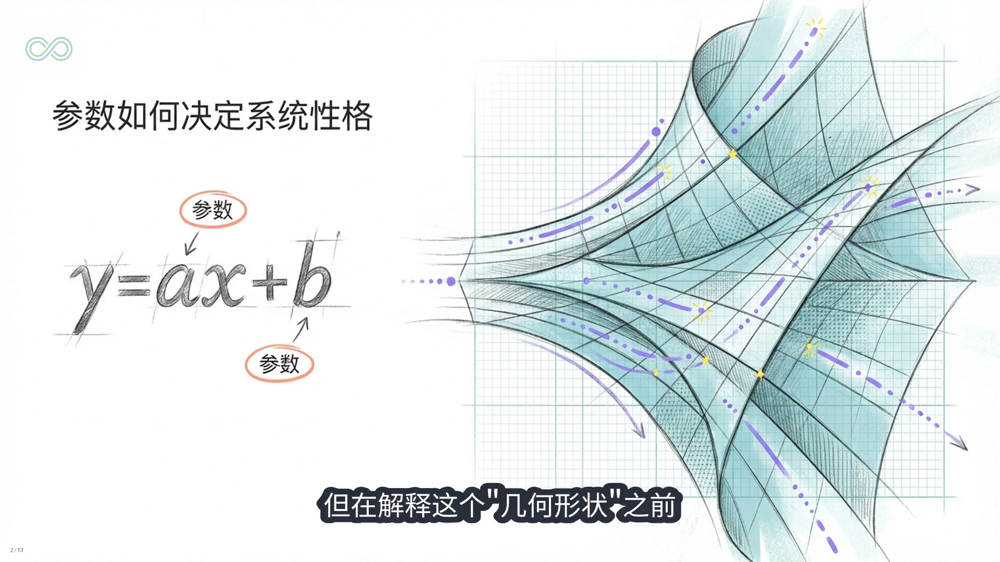

---

## 3. 内容结构

### 3.1 参数到底是什么

作者先从一个通俗问题切入：

- GPT 的万亿参数是不是万亿条知识？
- 是不是万亿个单词？
- 是不是万亿个 if else 规则？

随后借助 `y = ax + b` 来解释参数本质上是调节输入输出关系的量。

### 3.2 训练不是背书，而是压缩

作者强调：

- 如果只是存储文本，硬盘就够了
- 神经网络的价值在于提炼规律，而不是逐字记忆
- “压缩即智能”是理解大模型的关键句

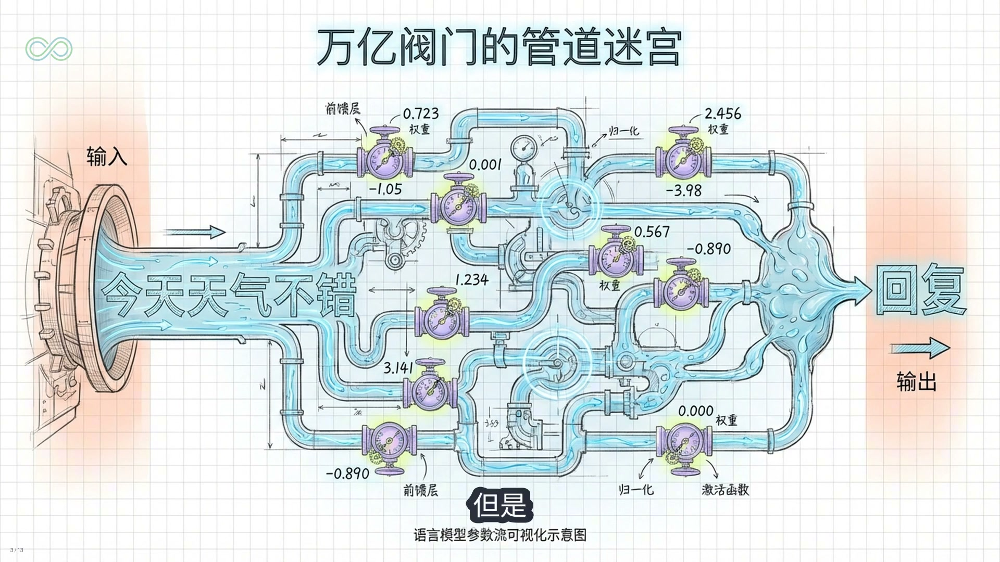

### 3.3 高维向量空间与语义几何

这是视频最关键的一段。作者认为：

- 每个词、概念都映射为高维空间中的一个点
- 概念之间的语义关系会表现为距离、方向和曲率
- 经典类比是：`king - man + woman = queen`

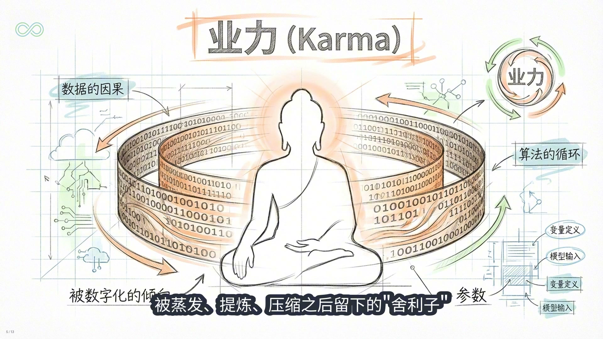

### 3.4 与人脑、佛学概念的类比

作者用以下概念做类比：

- 突触连接强度 ≈ 参数
- 阿赖耶识中的“种子” ≈ 参数中的潜在势能
- 业力 ≈ 训练后形成的认知倾向
- 英陀罗网 ≈ 分布式表示中的全息关系

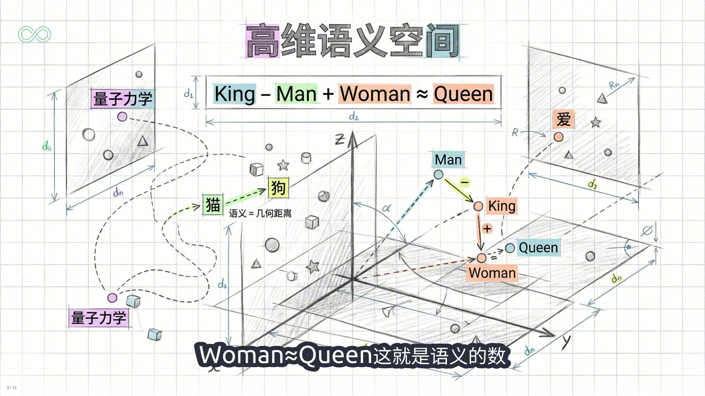

### 3.5 对现实世界的启发

作者最后把讨论落到实际应用层面：

- 参数规模竞赛边际收益递减
- 小模型会越来越重要
- 私有数据、微调、RAG 是关键护城河
- AI 更适合用来探索“为什么”和“怎么办”，而不是单纯查事实

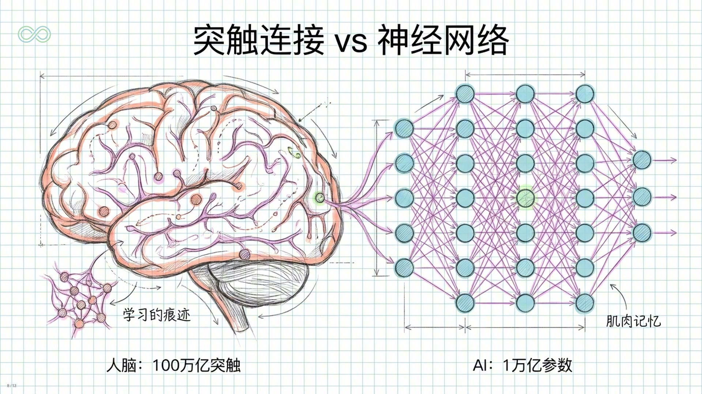

---

## 4. 结构化摘要

更完整的摘要请看：[`./douyin_summary.md`](./douyin_summary.md)

这里给一个压缩版：

1. **参数不是知识仓库，而是关系结构**
2. **训练不是死记硬背，而是对语言规律进行压缩**
3. **语义可被表示为高维空间中的几何关系**
4. **模型与人脑/佛学概念之间存在启发性的类比，但并非科学等价**
5. **人类在 AI 时代的价值将更偏向提问、判断、连接与创造**

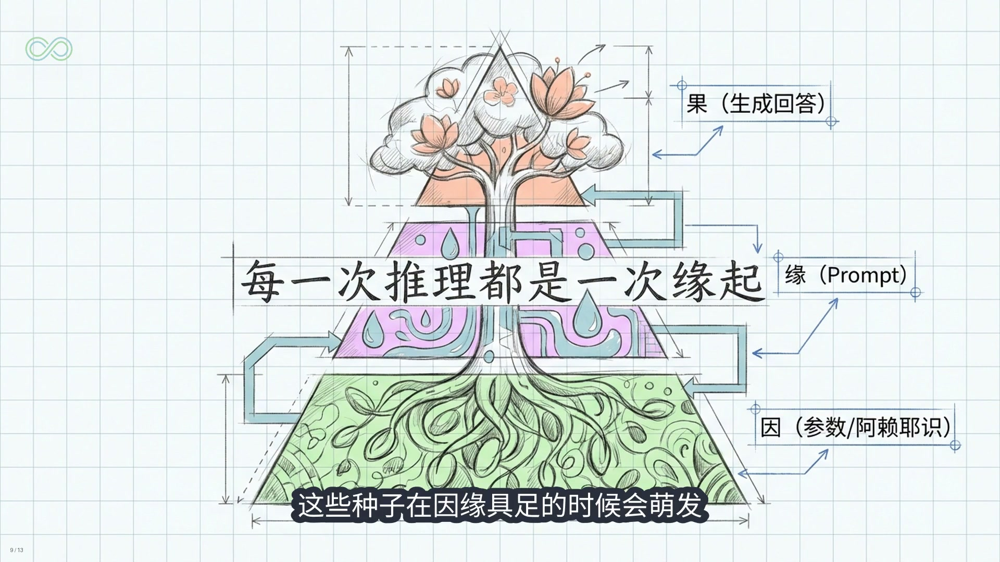

---

## 5. 需要核验或保持审慎的点

以下内容更适合作为“哲学类比”或“启发式表达”，不宜直接当作严格科学结论：

- “模型没有存任何具体知识”
- “参数与人脑突触完全同构”
- “参数就是阿赖耶识/业力”
- “宇宙本身就是参数空间”
- “AI 只能给出平均值，无法带来超额收益”

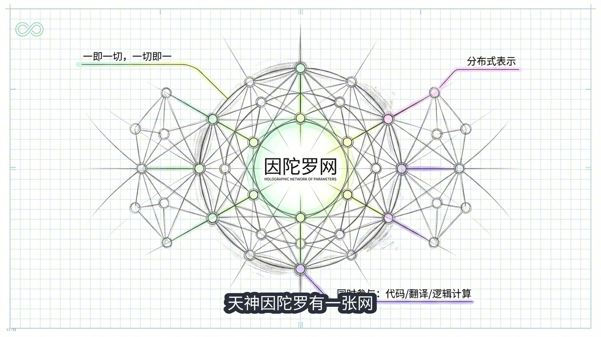

---

## 6. 配套文件引用

### 清洗逐字稿

请查看：[`./douyin_transcript_clean.md`](./douyin_transcript_clean.md)

### 原始自动转写稿

请查看：[`./douyin_transcript.md`](./douyin_transcript.md)

### 原始 txt 转写

请查看：[`./douyin_transcript.txt`](./douyin_transcript.txt)

---

## 7. 更多截图

### 后半段观点截图 1

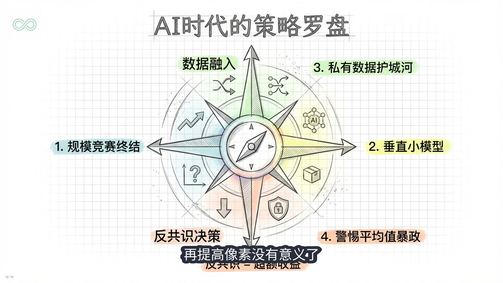

### 后半段观点截图 2

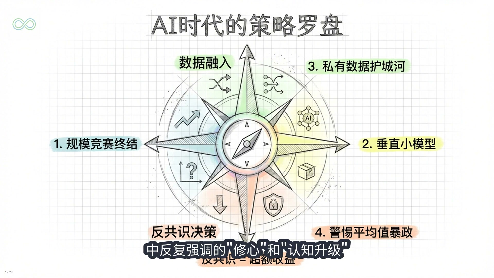

### 收尾截图 1

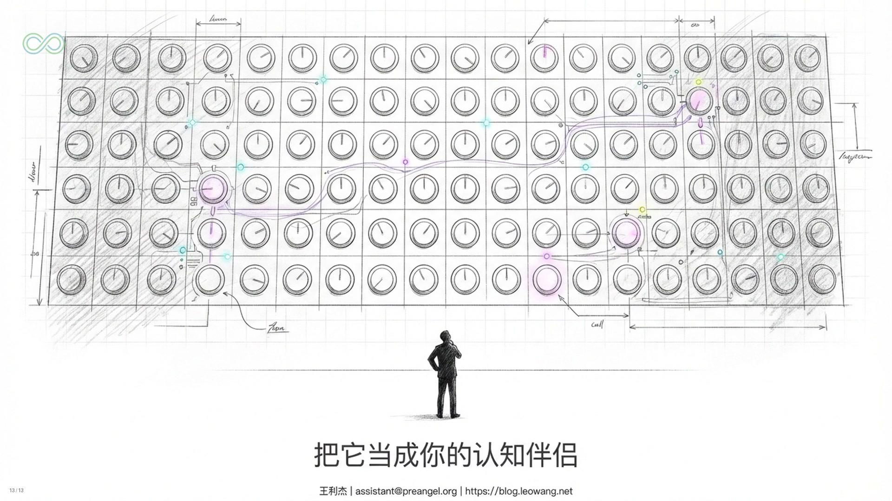

### 收尾截图 2

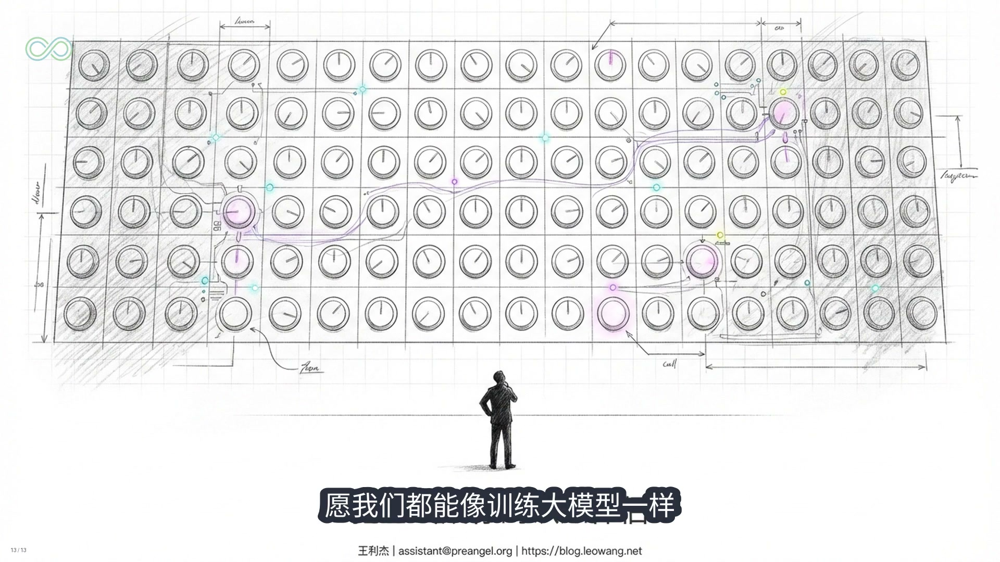

---

## 8. 归档目录完整路径

`/Users/redcreen/.openclaw/workspace-code/Work/douyin_package/`
